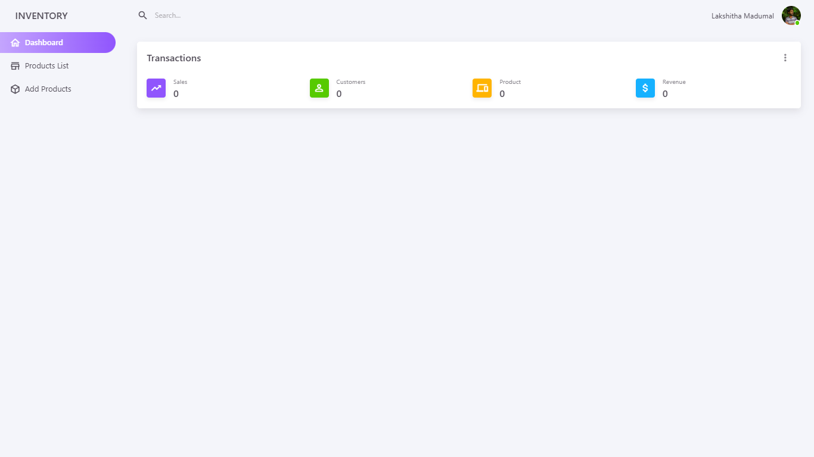
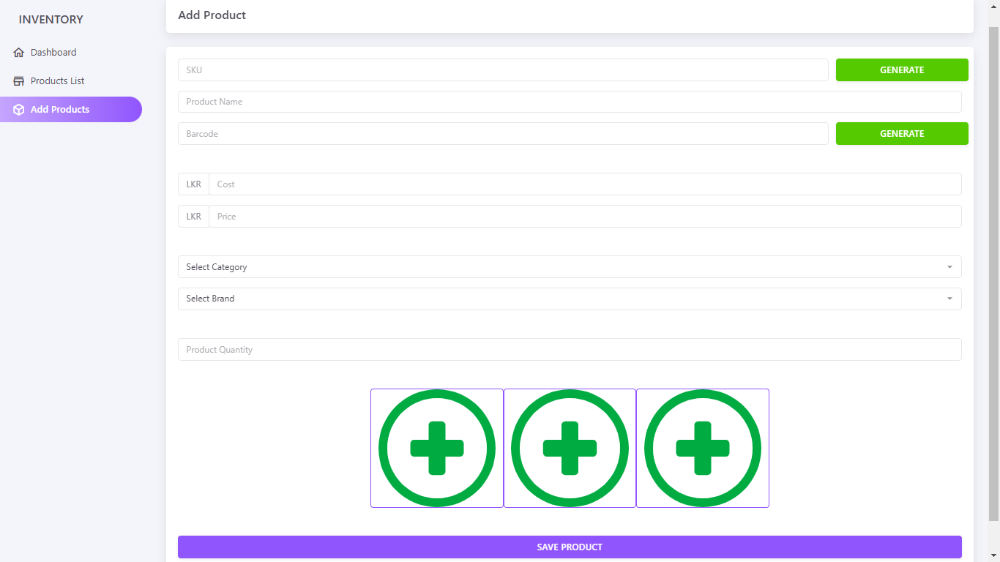
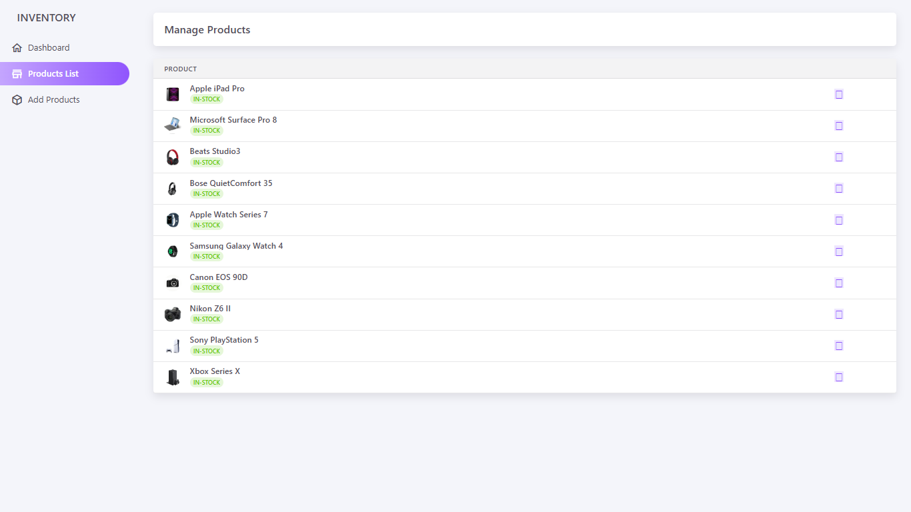

# Inventory Management System 📦🛒

This **Inventory Management System** 🔥 is a web-based application 🌐 designed to simplify product management, customer handling, and invoice generation. The system includes product adding, product listing, and product summary features, making inventory management more efficient and organized.

## Features 🔑
- Product Adding ➕
- Product Listing 📄
- Product Summary 📊
- Customer Management 👥
- Invoice Generation 🧾
- Dynamic Dashboard 📌

## Technologies Used 🛠️
- **SCSS** 🎨
- **JavaScript** ⚙️
- **PHP** 🔐
- **CSS** 💪
- **MySQL** 🗄️

## Installation 🔧
1. Clone the repository:
```bash
git clone https://github.com/lakshithamadumal/Inventory-Management-System.git
```

2. Import the database:
   - Navigate to your MySQL database via **phpMyAdmin** or MySQL CLI.
   - Execute the `inventory_db.sql` file located in the `db` folder.

3. Configure Database Connection:
   - Open the file:
   ```bash
   connection.php
   ```
   - Replace **"Your-MySQL-Password"** with your MySQL database password:
   ```php
   $password = "Your-MySQL-Password";
   ```

4. Start the server using **XAMPP** or any local server:
   - Place the project folder in the **htdocs** directory.
   - Start **Apache** and **MySQL** from the XAMPP control panel.

5. Access the system via:
   ```bash
   http://localhost/Inventory-Management-System
   ```

## Screenshots 📸






## Contributing 🤝
Feel free to fork this project and submit pull requests. Any contributions are welcome! 🙌

## License 📄
This project is licensed under the **MIT License**.

---

Developed with ❤️ by **Lakshita Madumal** 🧑‍💻

#InventoryManagement #WebApp #PHP 🔥 #SCSS 🎨 #JavaScript ⚙️ #MySQL 🗄️ #XAMPP 🌐

